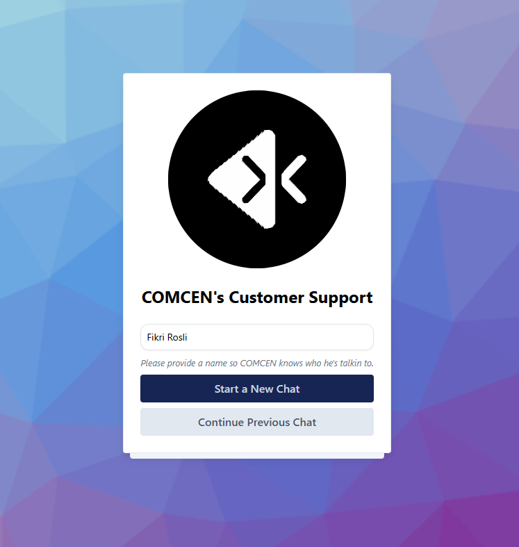
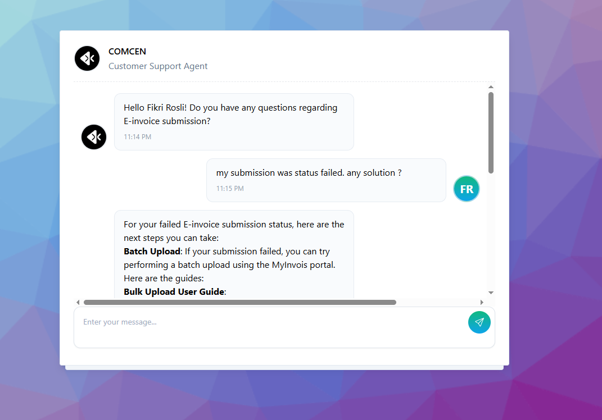

# COMCEN AI Chatbot Customer Support Demo

## Overview

This is a demo application for a customer support AI chatbot named **COMCEN**. The chatbot interacts with users in real-time to assist with tasks such as **e-Invoice submission troubleshooting** and more.

## Tech Stack

- **Frontend Framework**: [Nuxt.js](https://nuxt.com/)
- **Styling**: [Tailwind CSS](https://tailwindcss.com/)
- **Backend**: Nuxt server API routes
- **AI Integration**: OpenAI SDK (Assistant API)
- **Learning Source**: Custom PDF guides used to instruct the AI assistant

## Features

- 🔹 Real-time customer support chat interface
- 🔹 AI assistant built using OpenAI Assistant API
- 🔹 Custom instruction for assistant with PDF documentation
- 🔹 User-friendly UI built with TailwindCSS
- 🔹 Dynamic API routes in Nuxt for `GET` and `POST` interaction with OpenAI

## Instructions

1. Clone the repository and install dependencies.
2. Set up your OpenAI API key in environment variables.
3. Upload the PDF guide used to train the assistant.
4. Run the Nuxt server locally or deploy using services like Vercel or Netlify.

## Screenshots

### Chat UI

### Chat Interaction with AI

---

> This project showcases the potential of integrating AI with modern web technologies for smart and automated customer support solutions.
